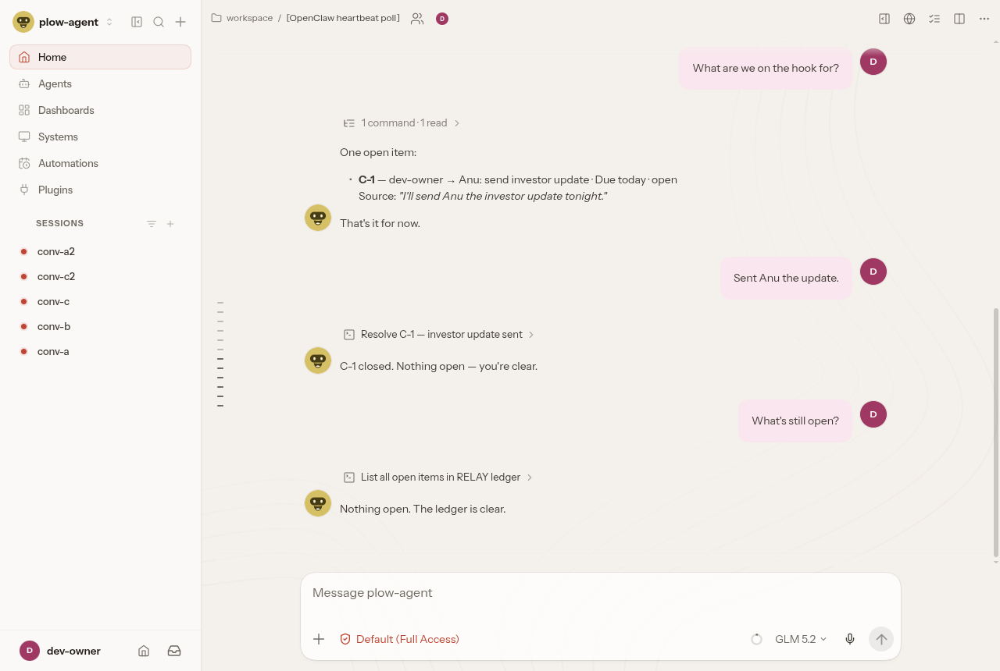

# RELAY

**The First Hire Who Never Forgets.**
Your startup's collective operational memory, running as an [OpenClaw](https://github.com/openclaw/openclaw) agent.

> "What did we promise, to whom, by when — and what is still open?"

RELAY answers that question for the whole team. It listens in the conversations it is part of,
turns promises, customer issues and decisions into a shared ledger with sources, reminds
the team every morning, and drafts follow-ups that go out only after a teammate approves them.



## The problem

Small teams run on chat. A co-founder promises an investor an update in one thread, a
customer reports a bug in another, a decision gets made in a DM. Nobody owns the list, so
things slip, and the person waiting on you notices before you do.

## What RELAY does

```
Channels (Slack · Telegram · WhatsApp · Discord · Plow phone line / email …)
   ↓   every conversation the agent is in
OpenClaw  (sessions, skills, automations, message tool)
   ↓
RELAY extraction      commitment-tracker skill: who · what · to whom · by when · evidence · confidence
   ↓
Shared ledger         one file every session reads/writes · dedupe · provenance · audit log in memory/
   ↓
Recall                "what's open?" · "what did we promise Anu?" · morning brief · overdue nudges
   ↓
Human approval        draft → "approve A-1"
   ↓
Action                sent once via OpenClaw's message tool, receipt recorded
```

Example — two people, two chats, one memory:

```
Aaditya (Slack #founders):   I'll send Anu the investor update tonight.
Priya   (WhatsApp support):  Acme says export is broken again.
Meera   (Telegram DM):       What are we on the hook for?

RELAY:  2 open
        C-1 Aaditya → Anu: send the investor update · due today
            Source: "I'll send Anu the investor update tonight." — Aaditya, slack:#founders
        I-1 Acme: export is broken again · no owner
            Source: "Acme says export is broken again." — Priya, whatsapp:support
        Next: assign an owner for I-1?
```

## What makes it different

Most "action item" tools summarise one meeting for one person. RELAY is the shared memory of a
whole team across every chat, and it is built to be safe to act on. Each of these is enforced by
the engine and covered by tests, and each comes from recent research on agent memory:

| Feature | What happens | Research |
| --- | --- | --- |
| **Two-way ledger** | Tracks what *others* promised the team, not only what the team owes: "Rahul said he'll send the term sheet Friday" becomes *Rahul owes us*, with overdue nudges drafted for approval. `relay list --waiting-on` | Smart To-Do ([arXiv 2005.06282](https://arxiv.org/abs/2005.06282)); AI-powered reminders for collaborative tasks ([arXiv 2403.01365](https://arxiv.org/abs/2403.01365)) |
| **Stale-draft guard** | An approval is bound to the item as it was when drafted. If the issue gets fixed or the deadline moves before someone says "approve A-2", the draft goes stale and is never sent. | Fresh Memory, Stale Plans ([arXiv 2609.03340](https://arxiv.org/abs/2609.03340)) |
| **Conflict detection** | When two teammates give different deadlines or owners for the same promise, RELAY keeps the current value, flags both versions with who said each, and asks. The owner rescheduling their own promise is just an update. | Governed Shared Memory ([arXiv 2606.24535](https://arxiv.org/abs/2606.24535)) |
| **Tentative queue** | Hedged talk ("maybe I'll look into SOC2") is staged as tentative, not dropped and not counted as a promise, until someone confirms or rejects it. A clear restatement promotes it. | MemTX transactional belief commit ([arXiv 2607.23929](https://arxiv.org/abs/2607.23929)) |
| **Trust-gated approvals** | Evidence is marked team or external (`RELAY_TEAM`). A draft that rests only on outside content, or goes to a contact nobody on the team mentioned, needs **two different teammates** to approve. An open conflict blocks approval. | MAP-Graph provenance-aware memory ([arXiv 2608.10509](https://arxiv.org/abs/2608.10509)) |

## Quick look (no OpenClaw needed)

```bash
git clone https://github.com/Aaditya1273/RELAY && cd RELAY
npm test          # 34 tests: extraction, dedupe, overdue, provenance, injection, approvals, multi-writer,
                  #           two-way ledger, stale drafts, conflicts, tentative queue, trust gate
npm run demo      # the full scenario above plus the five features, offline and deterministic
```

Requires Node 18+. No dependencies.

## Install into OpenClaw

```bash
sh scripts/install.sh            # default workspace: ~/.openclaw/workspace
openclaw skills list             # commitment-tracker, relay-query, relay-brief, relay-followup
```

Then schedule the brief and connect channels: **[QUICKSTART.md](QUICKSTART.md)** (10 minutes),
**[INSTALL.md](INSTALL.md)** (full). Running on Plow for the Agent Index: [HACKATHON.md](HACKATHON.md).

## What's in the box

| Path | Purpose |
| --- | --- |
| `skills/commitment-tracker/` | capture & resolve skill + the engine (`scripts/relay.mjs`, zero deps) |
| `skills/relay-query/` | "what's open / what did we promise X / what changed" |
| `skills/relay-brief/` | RELAY Morning brief |
| `skills/relay-followup/` | drafts + approval-gated sending |
| `prompt/AGENTS.md` | RELAY's operating rules (workspace AGENTS.md block; Plow prompt) |
| `workspace/` | SOUL.md, MEMORY.md policy, HEARTBEAT.md checklist |
| `Dockerfile` | variant image on the Plow OpenClaw base |
| `test/`, `scripts/demo.sh` | tests and offline demo |

## Status (honest)

| | |
| --- | --- |
| Engine: capture, dedupe, resolve, query, brief, changes, people, approvals | **Working** — covered by tests |
| Multi-writer safety (several sessions writing at once) | **Working** — tested with 8 concurrent processes |
| Two-way ledger, stale-draft guard, conflicts, tentative queue, trust gate | **Working in the engine** — unit + CLI tests and `npm run demo`; skills updated. Not yet re-run on a live gateway |
| Skills + AGENTS.md on a live OpenClaw gateway (2026.9.6, Gemini) | **Working** — capture, cross-session recall, resolve, draft, approval gate, injection test run live ([VERIFICATION.md](VERIFICATION.md)) |
| Morning brief as an OpenClaw automation | **Working** — run on the live gateway; channel delivery needs your channel + target |
| Sending approved follow-ups | **Config required** — live run correctly cancelled with no channel; a real send needs a configured channel |
| Discord / Telegram / other channels | **Config required** — see CHANNELS.md |
| Plow image | **Working locally** — built on the Plow OpenClaw base, deployed with `plow-agents deploy --local`, scenario passed on Plow's model; publishing needs a public registry push |
| Latch (Mac) actions, task/calendar creation | **Not implemented** beyond the approval gate; used only if a tool is present |
| Gmail ingestion | **Not implemented** |

Limitations and threat model: [SECURITY.md](SECURITY.md). Design: [ARCHITECTURE.md](ARCHITECTURE.md).

## Credits

RELAY is original work, MIT licensed. Its operating-model ideas (a source-of-truth layer,
a priority policy, act/draft/escalate resolution modes) were informed by studying
[clawchief](https://github.com/snarktank/clawchief) by Ryan Carson; no clawchief text or code is
included. See [DEVELOPMENT_NOTES.md](DEVELOPMENT_NOTES.md) and [THIRD_PARTY_NOTICES.md](THIRD_PARTY_NOTICES.md).
